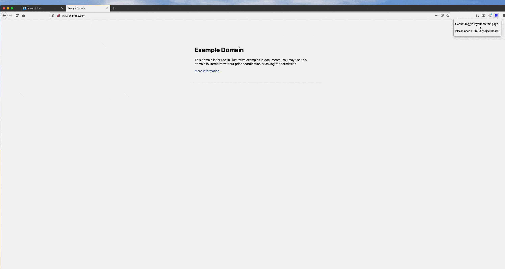

# layout-trello-ff

Firefox plugin to toggle Trello board views (vertical, horizontal, or mixed). Inspired by [Natalie Chouinard's Chrome extension](https://github.com/sudonatalie/layout-trello).

# Build

The easiest way to generate the extension from the code is to use [web-ext](https://github.com/mozilla/web-ext).

Once installed, invoke the `generate.sh` script from inside the project root:

```bash
$ chmod a+x generate.sh
$ ./generate.sh
```

This should bundle the extension using a name like so: `layout-trello-ff-<version in manifest>.zip` in the `web-ext` directory.

# Demo




# LICENCE

See [LICENCE.md](LICENCE.md).
